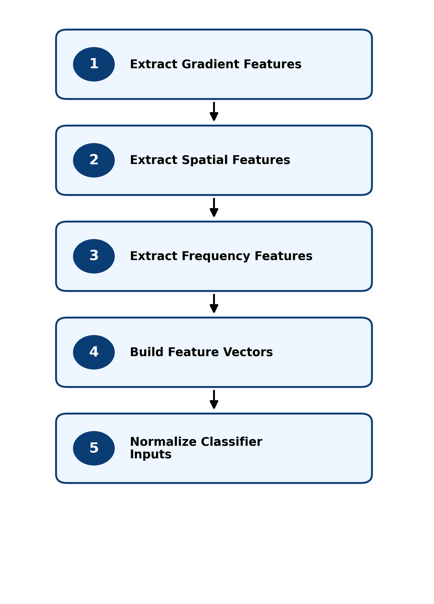

# 2. Model Description Tutorial

## Overview

This section describes the modeling approach used for AI-generated image detection based on Digital Image Processing (DIP) features. Rather than relying on end-to-end deep learning, the project uses a feature-engineering approach in which carefully designed image descriptors are extracted and used as input to classical machine learning models.

The pipeline described in this section focuses on feature extraction, feature vector construction, and normalization, providing the input representation used for all subsequent modeling stages. This structured approach emphasizes interpretability, modularity, and the ability to generalize across datasets.

  

<em>Figure: Feature extraction and input preparation workflow.</em>

## Model Description

Each image is represented by a fixed-length DIP feature vector derived from multiple complementary feature groups. Gradient-based features capture edge structure and directional patterns, spatial features describe intensity distribution and texture, and frequency-domain features represent spectral characteristics. These feature groups are combined into a unified representation that serves as input to the classifier.

The feature extraction process is designed to capture different aspects of image content, allowing the model to distinguish between real and AI-generated images based on statistical and structural properties rather than learned visual patterns alone.

Following feature construction, all feature values are normalized using a transformation fit on the training dataset. This ensures that features contribute consistently during model training and prevents bias caused by differing value ranges.

## Workflow

This section defines the feature representation and input preparation stages of the modeling pipeline, beginning with feature extraction and ending with normalized feature vectors ready for classification.

- [04A Extract Gradient Features](04A_Extract_Gradient_Features.md) — compute gradient-based descriptors
- [04B Extract Spatial Features](04B_Extract_Spatial_Features.md) — compute spatial-domain descriptors
- [04C Extract Frequency Features](04C_Extract_Frequency_Features.md) — compute frequency-domain descriptors
- [05 Build Feature Vectors](05_Build_Feature_Vectors.md) — combine feature groups into a unified representation
- [06 Normalize and Prepare Inputs](06_Normalize_and_Prepare_Inputs.md) — normalize features for classifier input

Each stage produces structured feature data that is used in subsequent modeling and evaluation steps.

## Notes

- The modeling approach emphasizes feature engineering over end-to-end deep learning
- All models operate on a consistent DIP feature representation
- Feature extraction is modular, allowing individual feature groups to be analyzed independently
- Normalization is applied using training data only to ensure valid evaluation

