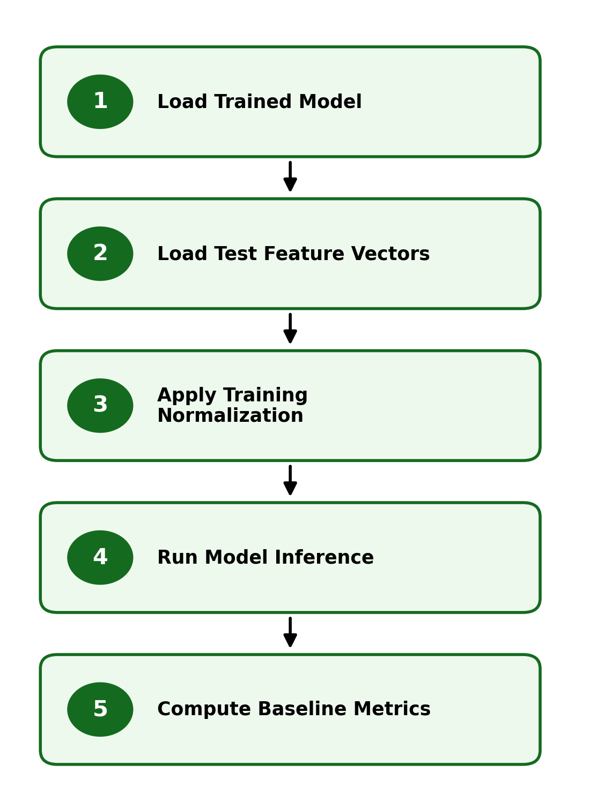

# 4. Basic Training Tutorial

## Overview

This section demonstrates how a trained model is loaded and applied to test data to produce predictions. The focus is on verifying that the modeling pipeline operates correctly by evaluating baseline performance on the test dataset.

The process includes loading a trained model, preparing input data, and running inference on test samples. This provides a simple and direct validation of the end-to-end system before more advanced tuning and evaluation are performed.

  

<em>Figure: Baseline evaluation using trained models on test data.</em>

## Testing Approach

Basic testing is performed by applying a trained classifier to feature vectors derived from the test dataset. The model is loaded from a saved file and used to generate predictions and evaluation metrics.

Feature vectors are first normalized using the same transformation applied during training, ensuring consistency between training and testing conditions. The model is then used to compute predictions, and standard performance metrics such as accuracy, precision, recall, F1-score, and ROC-AUC are generated.

This stage establishes a baseline level of performance and confirms that the trained model can generalize to unseen data. It also provides a reference point for subsequent fine-tuning and optimization steps.

## Workflow

This section demonstrates the basic evaluation process using a trained model.

- [10 Basic Testing](10_Basic_Testing.md) — load trained model and evaluate baseline performance on test data

The notebook implements a complete evaluation cycle, including data preparation, model inference, and metric computation.

## Notes

- The test dataset is used only for independent evaluation
- Model loading is performed using saved model artifacts
- Feature normalization must match the transformation used during training
- This stage provides a baseline for comparison with later fine-tuning results

