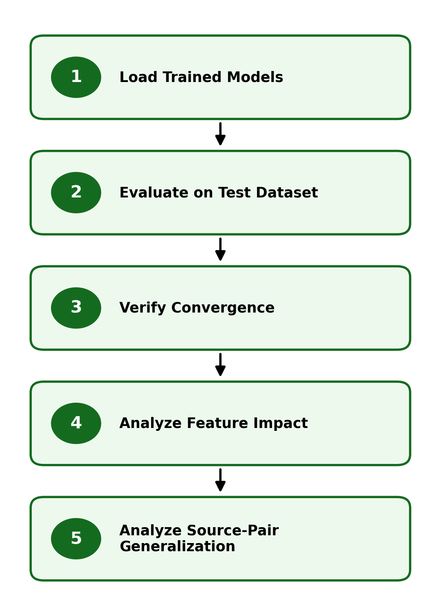

# 6. Full Training Tutorial

## Overview

This section presents the final training and evaluation stage of the pipeline. At this point, the dataset has been prepared, feature vectors have been constructed and normalized, and optimized classifier configurations have been identified.

The goal of this stage is to verify that the training process has converged and to evaluate model performance on unseen data. This represents the transition from model development to final performance assessment and interpretation.

  

<em>Figure: Final evaluation and performance analysis workflow.</em>

## Training and Evaluation Strategy

Final evaluation is performed using a held-out test dataset that has not been used during training or cross-validation. Trained classifiers are applied to normalized test feature vectors to generate predictions and class probabilities.

Model performance is assessed using standard classification metrics, including accuracy, precision, recall, F1-score, and ROC-AUC. In addition, convergence behavior is examined using training and validation loss curves to confirm that the models have learned effectively and are not overfitting.

Additional evaluation artifacts such as confusion matrices and ROC curve data are used to provide a detailed view of classification performance and decision thresholds. Multi-curve ROC visualizations are used to compare classification behavior across different source-pair experiments. Together, these metrics ensure an unbiased assessment of generalization.

Beyond standard evaluation, further analysis is performed to better understand model behavior. Feature-level analysis evaluates the predictive contribution of individual features, while source-pair analysis examines how performance varies across combinations of real and AI-generated datasets (3 real × 3 AI = 9 source-pair experiments).

These analyses provide insight into feature importance, dataset sensitivity, and the robustness of the DIP feature representation across different real and AI data sources.

## Workflow

This section completes the modeling pipeline by evaluating trained models and analyzing their performance across both feature-level and dataset-level dimensions.

* [12 Evaluate Two Models](12_Evaluate_Two_Models.md) — perform final evaluation on the independent test dataset, including performance metrics and convergence analysis
* [13 Feature-Level Analysis](13_Feature_Level_Analysis.md) — analyze the contribution and impact of individual features
* [14 Source-Pair Analysis](14_Source_Pair_Analysis.md) — evaluate generalization across dataset combinations

Each notebook builds on the trained models to provide both quantitative performance results and deeper analytical insight.

## Notes

* The test dataset is used only for final evaluation and remains independent from all training and cross-validation steps
* Evaluation includes both performance metrics and convergence verification
* Feature-level and source-pair analyses provide insight into robustness and generalization
* This stage produces the results used for final interpretation and reporting

{: .no_toc }

