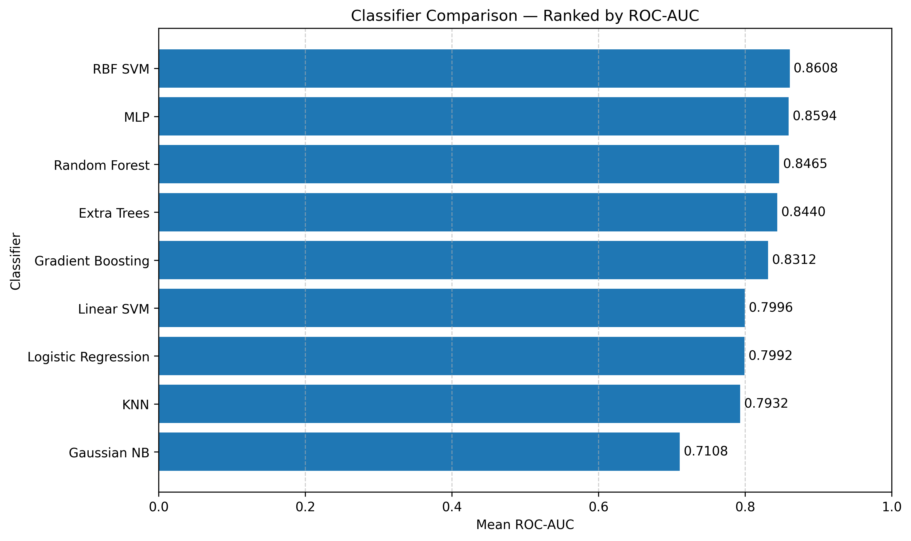
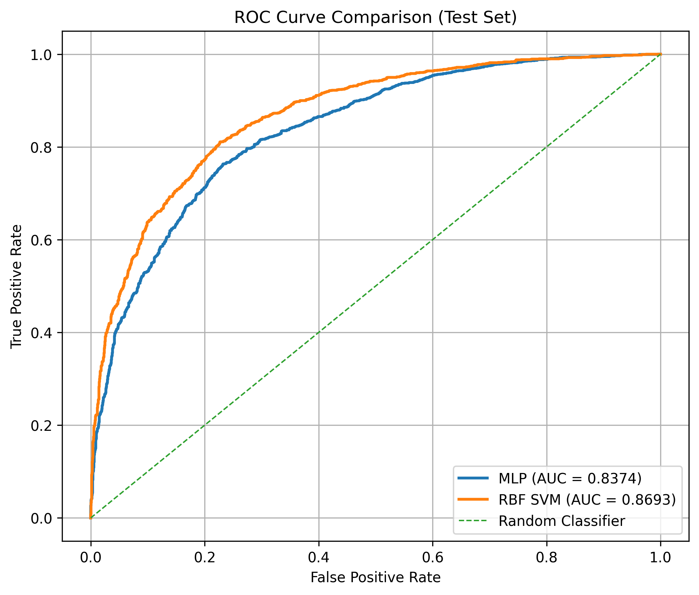
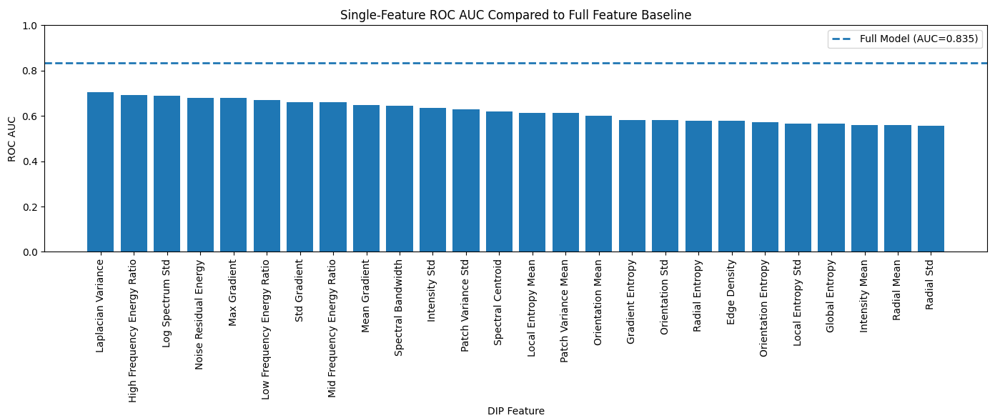
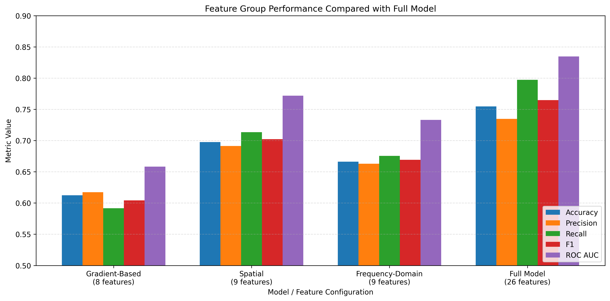
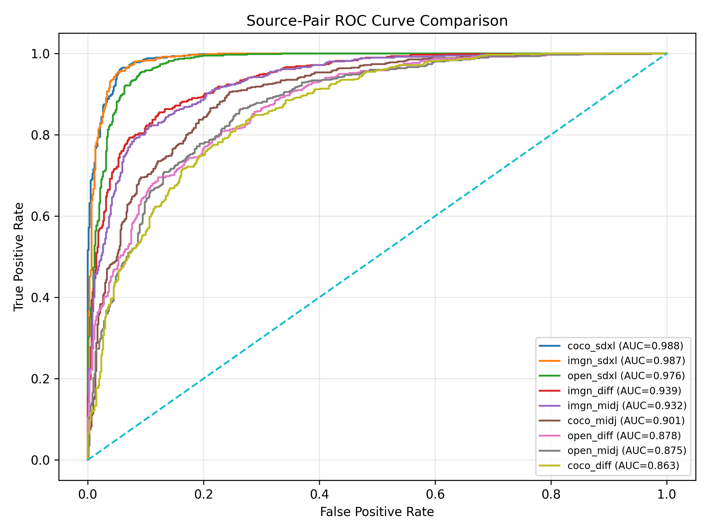

# 7. Results & Insights

## Overview

This section presents the experimental results and analytical insights obtained from the Digital Image Processing (DIP)–based AI image detection pipeline. The objective is not only to report classification performance, but also to examine how different feature types, model choices, and dataset combinations influence overall detection behavior and generalization capability.

The experiments evaluate the effectiveness of a handcrafted 26-feature DIP representation derived from gradient-domain, spatial-domain, and frequency-domain image characteristics. Multiple classifiers, feature subsets, and dataset pairings were analyzed to better understand which components contribute most strongly to robust AI-image detection.

The results are organized into the following major analysis categories:

- **Classifier Comparison** — Evaluation of multiple baseline classifiers using stratified cross-validation

- **Final Model Selection and Performance Summary** — Comparison and evaluation of the top-performing tuned classifiers on the independent test set

- **Feature-Level Results and Analysis** — Evaluation of the discriminative strength and standalone predictive capability of individual DIP features

- **Group-Level Results and Analysis** — Comparison of gradient-domain, spatial-domain, and frequency-domain feature groups and their contribution to classification performance

- **Source-Pair Analysis and Generalization Insights** — Evaluation of model robustness across multiple real-versus-AI source pairs, including interpretation of cross-source behavior and generator-independent detection performance

- **Experimental Observations** — Additional findings and practical insights that emerged outside the primary objectives of the major evaluation notebooks

- **Key Takeaways** — Summary of the primary findings, experimental insights, and overall conclusions of the project

Together, these results demonstrate how explicit DIP feature engineering can provide strong classification performance while also offering interpretability and deeper insight into the statistical differences between real and AI-generated imagery.

---

## Classifier Comparison

This experiment evaluated multiple baseline classifiers using the normalized 26-feature DIP representation. All models were assessed using stratified 5-fold cross-validation, with mean ROC-AUC used as the primary ranking metric.

The goal of this stage was to identify which classifier architectures were most effective at separating real and AI-generated images before performing final model tuning and independent test evaluation.

  

<em>Figure 1: Baseline classifier comparison ranked by mean ROC-AUC</em>

The results show that nonlinear classifiers consistently outperformed simpler linear and probabilistic approaches. In particular, the **Radial Basis Function Support Vector Machine (RBF SVM)** and **Multi-Layer Perceptron (MLP)** achieved the strongest overall performance across multiple evaluation metrics, while tree-based ensemble methods also demonstrated strong classification capability.

<em>Table 1: Cross-validation performance summary across all evaluated baseline classifiers</em>

| Classifier | Accuracy | Precision | Recall | F1 Score | ROC-AUC |
|---|---:|---:|---:|---:|---:|
| RBF SVM | 0.7779 | **0.7723** | 0.7882 | 0.7802 | **0.8608** |
| MLP | **0.7790** | 0.7717 | **0.7925** | **0.7819** | 0.8594 |
| Random Forest | 0.7646 | 0.7690 | 0.7565 | 0.7627 | 0.8465 |
| Extra Trees | 0.7594 | 0.7590 | 0.7606 | 0.7597 | 0.8440 |
| Gradient Boosting | 0.7494 | 0.7462 | 0.7560 | 0.7510 | 0.8312 |
| Linear SVM | 0.7308 | 0.7248 | 0.7444 | 0.7344 | 0.7996 |
| Logistic Regression | 0.7304 | 0.7237 | 0.7454 | 0.7343 | 0.7992 |
| KNN | 0.7240 | 0.7264 | 0.7187 | 0.7224 | 0.7932 |
| Gaussian NB | 0.6508 | 0.6462 | 0.6660 | 0.6558 | 0.7108 |

Several important observations can be made from these results:

* **RBF SVM** achieved the highest overall ROC-AUC, suggesting that nonlinear decision boundaries are highly effective for modeling the statistical separation between real and AI-generated imagery within the DIP feature space.

* **MLP** produced nearly identical performance to the RBF SVM, indicating that the DIP feature representation is also highly compatible with neural-network-based classification. Although the RBF SVM achieved the highest ROC-AUC, the MLP demonstrated comparable overall performance while also producing the highest F1 score and recall among all evaluated classifiers.

* **Tree ensemble methods** (Random Forest, Extra Trees, and Gradient Boosting) also demonstrated strong performance, indicating that many DIP features contain informative nonlinear interactions that can be effectively exploited through recursive feature partitioning.

* **Linear models** (Linear SVM and Logistic Regression) performed noticeably worse, suggesting that the separation between real and synthetic imagery is not purely linearly separable.

* **K-Nearest Neighbors (KNN)** achieved moderate performance but lagged behind the strongest nonlinear classifiers, suggesting that local neighborhood relationships alone are insufficient to fully model the complex statistical structure present within the DIP feature space.

* **Gaussian Naive Bayes** produced the weakest performance, likely because the DIP features violate the model’s independence assumptions.

---

## Final Model Selection and Performance Summary

Following baseline classifier comparison and hyperparameter tuning, the final evaluation stage focused on the two strongest candidate classifiers: the **Radial Basis Function Support Vector Machine (RBF SVM)** and the **Multi-Layer Perceptron (MLP)**.

Both models were trained using the normalized 26-feature DIP representation and evaluated using an independent test dataset that was completely isolated from training and cross-validation procedures. This separation ensured that the final evaluation reflected true generalization performance without optimization bias or data leakage.

The final evaluation used several complementary performance metrics:

* **Accuracy** — overall classification correctness
* **Precision** — reliability of AI-generated image predictions
* **Recall** — ability to correctly identify AI-generated images
* **F1 Score** — balanced measure of precision and recall
* **ROC-AUC** — threshold-independent measure of class separability

Receiver Operating Characteristic (ROC) analysis was used as the primary evaluation method because it measures classifier behavior across all decision thresholds rather than at a single operating point.

<em>Table 2: Performance comparison of untuned and tuned selected classifiers</em>

| Models | Accuracy | Precision | Recall | F1 Score | ROC-AUC |
|---|---:|---:|---:|---:|---:|
| Tuned RBF SVM | **0.7989** | **0.7936** | **0.8081** | **0.8007** | **0.8794** |
| Untuned RBF SVM | 0.7779 | 0.7723 | 0.7882 | 0.7802 | 0.8608 |
| Tuned MLP | **0.7576** | **0.7429** | **0.7893** | **0.7650** | **0.8403** |
| Untuned MLP | 0.7790 | 0.7717 | 0.7925 | 0.7819 | 0.8594 |

  

<em>Figure 2: ROC curve comparison on the independent test set</em>

Several important observations emerge from the final evaluation:

* The **RBF SVM** achieved the strongest overall ROC-AUC, with its ROC curve remaining above the MLP across most operating regions, indicating more consistent threshold-independent class separability on unseen data.

* The **MLP** also demonstrated strong and stable performance, confirming that neural-network-based classification remains highly effective within the DIP feature space.

* Both models generalized effectively on unseen data, and the smooth ROC trajectories suggest stable classifier behavior rather than isolated decision-region performance.

Although the RBF SVM achieved the strongest overall ROC-AUC, the MLP learns distributed nonlinear feature interactions through layered representations, making it well suited for analyzing how gradient-domain, spatial-domain, and frequency-domain features collectively influence classification behavior across varying dataset combinations. The MLP was therefore selected as the primary model for subsequent analyses.

---

## Feature-Level Results and Analysis

Feature-level analysis was performed to evaluate the standalone discriminative capability of each individual DIP feature within the 26-feature representation. In this experiment, classifiers were trained using one feature at a time, and the resulting ROC-AUC values were compared against the full multi-feature baseline model.

The objective of this analysis was to better understand:

* Which features provide the strongest independent predictive power
* Which features contribute primarily through interaction with other features
* How different statistical image characteristics influence AI-image detection performance

  

<em>Figure 3: Single-feature ROC-AUC performance compared to the full-feature baseline model</em>

The results show that several individual DIP features exhibit strong standalone classification capability, although none individually matched the performance of the complete combined feature representation.

Several important observations emerge from this analysis:

* **Frequency-domain features** consistently ranked among the strongest standalone predictors, suggesting that AI-generated imagery contains detectable spectral irregularities and abnormal frequency distributions.

* **Gradient-domain and spatial-domain features** also demonstrated strong performance, indicating that edge structure, local directional statistics, texture consistency, and image smoothness differ measurably between real and synthetic images.

* The relatively gradual decline in single-feature ROC-AUC values suggests that discriminative information is distributed across many DIP features rather than concentrated within a single dominant predictor.

* No individual feature approached the performance of the full combined model, reinforcing the importance of integrating complementary information across multiple statistical image domains.

The dashed horizontal line in the figure represents the full-feature baseline ROC-AUC, highlighting the performance improvement achieved when all DIP features are combined into a unified representation.

Overall, the feature-level analysis demonstrates that AI-generated image artifacts are distributed across multiple statistical image domains rather than isolated to a single characteristic. This supports the use of a diverse handcrafted DIP feature representation for robust generator-independent detection.

---

## Group-Level Results and Analysis

Group-level analysis was performed to evaluate the relative contribution of the three major DIP feature domains:

* **Gradient-Based Features**
* **Spatial-Domain Features**
* **Frequency-Domain Features**

Each feature group was evaluated independently using the same classification pipeline and compared against the complete 26-feature model. This experiment was designed to determine how much discriminative information is contained within each image-analysis domain and how strongly the groups complement one another when combined.

  

<em>Figure: Performance comparison between individual feature groups and the full combined model</em>

The results show that all three feature domains contribute meaningful classification information, although their standalone performance varies considerably. The **spatial-domain feature group** achieved the strongest standalone performance across most evaluation metrics, suggesting that texture consistency, entropy characteristics, and fine-scale structural behavior are especially informative for distinguishing real and AI-generated imagery. The **frequency-domain feature group** also demonstrated strong performance, reinforcing the observation that AI-generated images often exhibit detectable spectral irregularities and abnormal frequency distributions. Although the **gradient-based feature group** produced the weakest standalone performance, it still contributed meaningful complementary information to the full model.

The full combined model substantially outperformed all isolated feature groups, demonstrating that integrating multiple statistical image domains produces a more robust and generalized AI-image detection representation.

---

## Source-Pair Analysis and Generalization Insights

To evaluate model robustness and cross-source generalization behavior, a total of **9 source-pair experiments** were conducted using all combinations of the following real-image and AI-generated datasets:

<table>
<tr>
<td valign="top">

<strong>Real-Image Datasets</strong>
<ul>
  <li>ImageNet_1K_256(imgn)</li>
  <li>MS_COCO_2017(coco)</li>
  <li>OpenImages (open)</li>
</ul>

</td>
<td style="width:80px;"></td>
<td valign="top">

<strong>AI-Generated Datasets</strong>
<ul>
  <li>DiffusionDB (diff)</li>
  <li>Midjourney (midj)</li>
  <li>SDXL_Generated_10K (sdxl)</li>
</ul>

</td>
</tr>
</table>

Each experiment trained and evaluated a classifier using a specific real-versus-AI dataset pairing. This analysis was designed to determine how strongly detection performance depends on dataset composition and whether the handcrafted DIP feature representation generalizes consistently across different image sources and generation methods.

<em>Table 3: Final evaluation metrics across all source-pair experiments</em>

| Source Pair | Accuracy | Precision | Recall | F1 Score | ROC-AUC |
|---|---:|---:|---:|---:|---:|
| coco_sdxl | 0.9492 | 0.9455 | 0.9533 | 0.9494 | 0.9881 |
| imgn_sdxl | 0.9500 | 0.9485 | 0.9517 | 0.9501 | 0.9866 |
| open_sdxl | 0.9275 | 0.9226 | 0.9333 | 0.9279 | 0.9761 |
| imgn_diff | 0.8650 | 0.8724 | 0.8550 | 0.8636 | 0.9388 |
| imgn_midj | 0.8517 | 0.8448 | 0.8617 | 0.8531 | 0.9323 |
| coco_diff | 0.8400 | 0.8411 | 0.8383 | 0.8397 | 0.9236 |
| coco_midj | 0.8317 | 0.8295 | 0.8350 | 0.8322 | 0.9204 |
| open_diff | 0.8125 | 0.8092 | 0.8175 | 0.8133 | 0.9031 |
| open_midj | 0.7983 | 0.7940 | 0.8033 | 0.7986 | 0.8917 |

Several important trends emerge from the source-pair experiments:

* **SDXL-based source pairs** consistently achieved the strongest performance, with ROC-AUC values approaching 0.99 in some cases, suggesting that SDXL-generated imagery contains highly separable statistical artifacts within the DIP feature space.

* **DiffusionDB** and **Midjourney** source pairs were generally more difficult to classify, indicating that some AI generators produce images whose statistical properties more closely resemble real-image datasets.

* Source pairs involving **OpenImages** typically produced lower performance than ImageNet or COCO pairings, likely because of the greater variability and diversity present within the OpenImages dataset.

* Despite substantial variation across source combinations, all experiments significantly outperformed random classification behavior, demonstrating meaningful cross-source generalization capability.

These results demonstrate that AI-image detection performance depends strongly on both the selected real-image dataset and the AI-generation method. Different generators introduce different statistical artifacts, while real-image datasets vary in texture diversity, image composition, noise characteristics, and compression behavior. As a result, some real-versus-AI combinations are substantially easier to separate than others.

  

<em>Figure 4: ROC curve comparison across all source-pair experiments</em>

The ROC curves further reinforce these observations. Stronger-performing source pairs rise rapidly toward the upper-left region of the plot, indicating excellent separability, while lower-performing combinations exhibit greater overlap between real and synthetic feature distributions. Despite variation across source combinations, the relatively consistent separation across all ROC curves suggests that the handcrafted DIP feature representation captures generalized statistical image characteristics rather than overfitting to a single dataset or generator source.

---

## Experimental Observations

A number of practical implementation and workflow observations emerged during development of the DIP-based AI-image detection pipeline outside the primary objectives of the major evaluation experiments.

* Separating preprocessing, feature extraction, normalization, training, tuning, and evaluation into independent notebooks simplified controlled experimentation and reduced the risk of unintended cross-stage dependencies.

* Use of a centralized `VERBOSE` flag simplified notebook readability while still supporting detailed debugging and intermediate inspection during development.

* CSV-based intermediate storage greatly improved modularity, reproducibility, and debugging by allowing each notebook stage to operate independently while preserving consistent feature-vector interfaces across the pipeline.

* The metadata-driven CSV approach simplified dataset sorting, shuffling, filtering, balancing, and train/test splitting operations without requiring repeated copying or movement of large image collections between directories.

* Once feature extraction was completed, all subsequent processing stages operated exclusively on compact CSV-based feature vectors rather than the original image files, significantly reducing storage overhead and simplifying downstream experimentation.

* The feature-extraction notebooks were intentionally designed to be executed twice: once for training data and once for test data. Although this separation was not strictly required, the approach provided additional confidence that strict train/test isolation was consistently maintained throughout the pipeline.

* Maintaining source-specific preprocessing and dataset-construction logic for all six image sources was necessary because individual datasets differed substantially in structure, naming conventions, metadata organization, and download mechanisms.

* The complete DIP pipeline was designed to operate efficiently on CPU-only systems without requiring GPU acceleration, demonstrating that meaningful AI-image detection remains feasible using lightweight handcrafted statistical features.

---

## Key Takeaways

The experimental results demonstrate that handcrafted Digital Image Processing (DIP) features provide an effective and interpretable foundation for AI-generated image detection. By combining gradient-domain, spatial-domain, and frequency-domain statistics into a unified feature representation, the proposed pipeline achieved consistently strong classification performance across multiple models, datasets, and evaluation scenarios.

Several major conclusions emerged from the analysis:

* **DIP-based feature engineering is highly effective** for distinguishing real and AI-generated imagery, even without end-to-end deep feature extraction.
* **Nonlinear classifiers**, particularly RBF SVM and MLP architectures, are well suited for modeling the complex statistical relationships present within the DIP feature space.
* **Multi-domain feature integration improves robustness**, with the combined feature representation consistently outperforming isolated feature groups and standalone features.
* **Frequency-domain and texture-related features** demonstrated especially strong discriminative capability, suggesting that synthetic imagery often contains measurable spectral and structural irregularities.
* **Dataset composition strongly influences performance**, indicating that both real-image diversity and AI-generator characteristics affect classification difficulty.
* **Source-pair analysis is essential** for evaluating true generalization behavior and avoiding overly optimistic conclusions based on limited datasets.
* **ROC curve analysis provides deeper insight** into classifier behavior than single-value metrics alone by evaluating performance across the full decision-threshold range.

Overall, the results support the central hypothesis of this project:

> **a carefully designed handcrafted DIP feature representation can provide robust and interpretable AI-image detection performance across multiple datasets and generation methods.** 

The project further demonstrates that generator-independent detection requires both diverse evaluation methodology and feature representations capable of capturing complementary statistical information across multiple image-analysis domains.

---

## Continue

➡️ [Thanks For Trying This Tutorial](Thanks_For_Trying_This_Tutorial.md)

