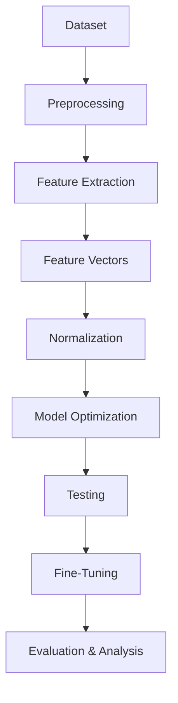
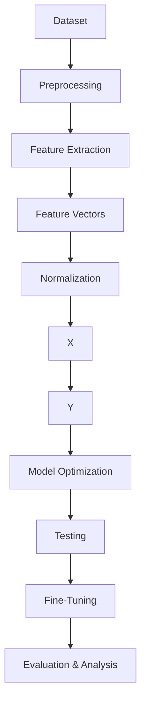

# DIP-Based AI Image Detection

## Overview

This project presents a tutorial and implementation for detecting AI-generated images using a feature-driven Digital Image Processing (DIP) pipeline. The method emphasizes engineered image statistics derived from gradient-based, spatial, and frequency-domain features rather than end-to-end deep image classification.

Instead of relying on generator-specific artifacts, this approach focuses on generalizable statistical differences between real and synthetic images.

## Key Idea

Each image is represented by a fixed set of **25 DIP features**, capturing complementary aspects of image structure:

- Gradient-based features (edge and orientation structure)
- Spatial features (intensity and texture)
- Frequency-domain features (spectral characteristics)

These features are used as input to classical machine learning classifiers, including a **Multi-Layer Perceptron (MLP)** and a **Radial Basis Function Support Vector Machine (RBF SVM)**.

## Pipeline Overview

The project is organized as a modular pipeline that transforms raw images into evaluated models:

## Pipeline Overview

This structure supports reproducibility, modular development, and clear separation of responsibilities across stages.

## Dataset

The dataset consists of **18,000 images**, balanced across real and AI-generated classes.

**Real images (9,000):**

- ImageNet
- MS COCO
- OpenImages

**AI-generated images (9,000):**

- DiffusionDB
- SDXL
- MidJourney

The dataset is split into training and test sets, with **k-fold cross-validation applied to the training data**. Class and source balance are maintained to prevent bias and data leakage.

## Models

Two classifiers are used for evaluation:

- **RBF SVM (Final Model)**
  Kernel: RBF
  C = 100, gamma = 0.01

- **MLP (Comparison Model)**
  Architecture: (128, 64, 32)
  Alpha = 0.001

## Evaluation Metrics

Model performance is assessed using:

* Accuracy
* Precision
* Recall
* F1 Score
* ROC Curve
* Area Under Curve (AUC)

## Repository Structure

The repository is organized into a small number of core directories:

- `docs/` — tutorial documentation (this site)
- `notebooks/` — Google Colab notebooks for each pipeline stage
- `src/` — reusable Python modules and configuration
- `metadata/` — dataset, feature, and model artifacts
- `data/` — dataset guidance and references

Large datasets are not stored directly in the repository.

## Getting Started

Use the navigation menu to follow the tutorial step-by-step. Each section provides:

- a conceptual overview
- linked notebook descriptions
- direct links to run notebooks in Google Colab

## Documentation

A full tutorial-style documentation site is provided through GitHub Pages.

## Author

**Phil Gailinas**
MS Computer Engineering (AI/ML focus) candidate at University of New Mexico

## License

This project is intended for academic and research use.

