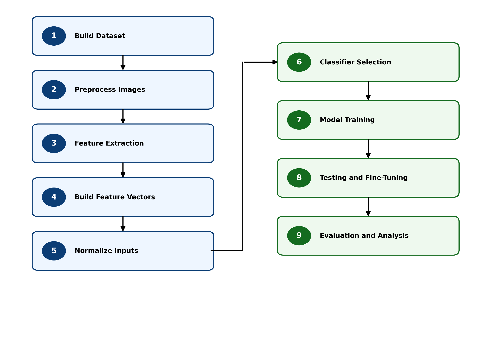


---
title: Home
nav_order: 0
---

# DIP-Based AI Image Detection

This tutorial presents a complete **Digital Image Processing (DIP) and machine learning pipeline** for detecting AI-generated images using engineered image statistics rather than end-to-end deep learning.

The project investigates whether compact, interpretable DIP features can capture meaningful differences between real and synthetic images across multiple image sources and AI generators.

## Project Overview

Each image is represented by a fixed **26-dimensional DIP feature vector** composed of:

- **Gradient-based features** — edge strength, gradient variation, and orientation structure
- **Spatial features** — intensity statistics, entropy, texture, and local variation
- **Frequency-domain features** — spectral energy distribution and radial frequency behavior

These handcrafted features are used with classical machine learning models to evaluate AI-image detection performance in a transparent and CPU-friendly workflow.

## Pipeline Structure

The tutorial follows a sequential notebook-based workflow covering:

- Dataset construction
- Image preprocessing
- DIP feature extraction
- Feature vector generation
- Model training and evaluation
- Feature analysis and robustness experiments

The complete workflow is illustrated below.

  

---

**IMPORTANT NOTE:**  
The tutorial notebooks are publicly available through GitHub and can be viewed without an account. Running them in Google Colab requires a Google account. Users may also clone or download the repository and run the notebooks locally using Jupyter.

## Tutorial Scope

In addition to the core training pipeline, the project includes extended experiments and analysis for evaluating:

- Feature-level discriminative strength
- Gradient, spatial, and frequency-domain feature groups
- Cross-source robustness
- Model generalization across multiple AI generators
- Final classifier comparison and ROC analysis

The workflow emphasizes interpretability, reproducibility, modularity, and CPU-friendly execution.

## Dataset

The project dataset contains **18,000 images**, balanced across real and AI-generated image classes.

<table>
<tr>
<td valign="top">

<strong>Real-Image Datasets</strong>
<ul>
  <li>ImageNet_1K_256</li>
  <li>MS_COCO_2017</li>
  <li>OpenImages</li>
</ul>

</td>
<td style="width:80px;"></td>
<td valign="top">

<strong>AI-Generated Datasets</strong>
<ul>
  <li>DiffusionDB</li>
  <li>Midjourney</li>
  <li>SDXL_Generated_10K</li>
</ul>

</td>
</tr>
</table>

The dataset is organized using metadata-driven control to preserve class balance, source identity, reproducibility, and separation between training and final evaluation data.

## Evaluation and Results

<table>
<tr>
<td valign="top">

<strong>Evaluation Metrics</strong>

<ul>
  <li>Accuracy</li>
  <li>Precision</li>
  <li>Recall</li>
  <li>F1 Score</li>
  <li>ROC Curve</li>
  <li>Area Under the Curve (AUC)</li>
  <li>Confusion Matrix</li>
</ul>

</td>

<td style="width:80px;"></td>

<td valign="top">

<strong>Final Analysis Includes</strong>

<ul>
  <li>Classifier comparison</li>
  <li>Final model performance</li>
  <li>Feature-level analysis</li>
  <li>Feature-group behavior</li>
  <li>Source-pair robustness</li>
  <li>Generalization trends</li>
  <li>Implementation observations</li>
</ul>

</td>
</tr>
</table>

## Project Design Philosophy

This project emphasizes:

- Interpretability through handcrafted DIP features
- Reproducibility through metadata-driven processing
- Modular notebook-based pipeline stages
- Public Colab accessibility
- CPU-friendly execution
- Cross-source generalization analysis

Rather than relying entirely on black-box deep learning methods, the tutorial explores how engineered image statistics can provide meaningful, interpretable, and generalizable detection signals.

## Author

**Phil Gailinas**  
M.S. Computer Engineering candidate  
University of New Mexico

## License

This project is intended for academic and research use.

