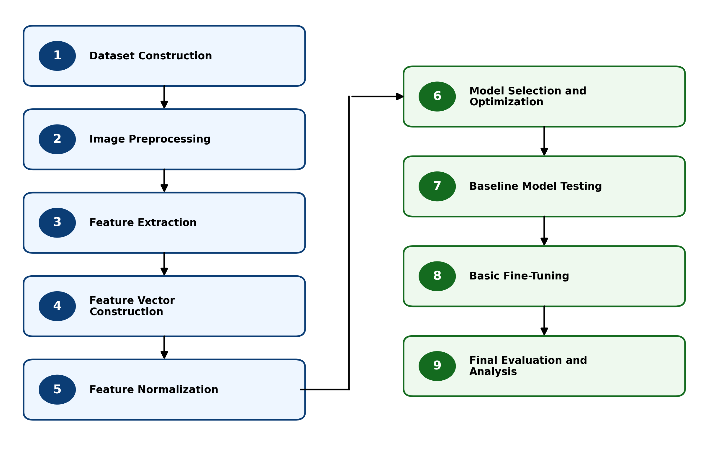

# DIP-Based AI Image Detection

This tutorial presents a **feature-driven Digital Image Processing (DIP)** approach for detecting AI-generated images using engineered image statistics and machine learning.

Instead of relying on end-to-end deep learning or generator-specific artifacts, the method focuses on **generalizable statistical differences** between real and synthetic images.

## Overview

Each image is represented by a fixed **25-dimensional DIP feature vector**, composed of:

- **Gradient-based features** (edge strength and orientation structure)
- **Spatial features** (intensity and texture statistics)
- **Frequency-domain features** (spectral energy and distribution)

These features provide a compact, interpretable representation of image structure suitable for classical machine learning models.

## Pipeline Overview

  

The diagram above illustrates the full pipeline. To begin implementation:

👉 **Start with [1. Dataset Tutorial](1. Dataset Tutorial.md)**

## Pipeline Stages

The pipeline consists of nine sequential stages:

1. **Build Dataset**  
   Assemble balanced datasets from real and AI-generated image sources.

2. **Preprocess Images**  
   Standardize image size, format, and quality.

3. **Combine and Split Metadata**  
   Construct balanced train/test splits using metadata-driven control.

4. **Extract DIP Features**  
   Compute gradient, spatial, and frequency-domain descriptors.

5. **Build Feature Vectors**  
   Assemble per-image feature representations.

6. **Normalize Features**  
   Apply scaling to prepare inputs for classifiers.

7. **Train Models**  
   Train candidate classifiers using the training dataset.

8. **Validate and Tune Models**  
   Perform cross-validation and hyperparameter tuning.

9. **Evaluate Final Models**  
   Assess performance on the held-out test dataset.

## Dataset

The dataset contains **18,000 images**, balanced across real and AI-generated classes.

**Real images (9,000):**
- ImageNet  
- MS COCO  
- OpenImages  

**AI-generated images (9,000):**
- DiffusionDB  
- SDXL  
- MidJourney  

Data is split into **training and test sets**, with **k-fold cross-validation applied to the training data**. Class and source balance are maintained to avoid bias and data leakage.

## Models

Two classifiers are evaluated:

- **RBF SVM (Final Model)**  
  Kernel: RBF  
  C = 100, gamma = 0.01  

- **MLP (Comparison Model)**  
  Architecture: (128, 64, 32)  
  Alpha = 0.001  

## Evaluation Metrics

Performance is assessed using:

- Accuracy  
- Precision  
- Recall  
- F1 Score  
- ROC Curve  
- Area Under the Curve (AUC)  

## How to Use This Tutorial

Navigate through the documentation using the left-hand menu.

Recommended workflow:

1. Start with **Notebook 01 — Build Dataset**  
2. Proceed sequentially through each pipeline stage  
3. Use notebook descriptions and Colab links to execute each step  

Each section provides:
- Conceptual explanations  
- Implementation details  
- Direct notebook access  

## Repository Structure

- `docs/` — tutorial documentation (this site)  
- `notebooks/` — Google Colab notebooks  
- `src/` — reusable Python modules and configuration  
- `metadata/` — dataset, feature, and model artifacts  
- `data/` — dataset guidance and references  

Large datasets are not stored directly in the repository.

## Author

**Phil Gailinas**  
M.S. Computer Engineering (AI/ML focus) candidate 
University of New Mexico  

## License

This project is intended for academic and research use.

